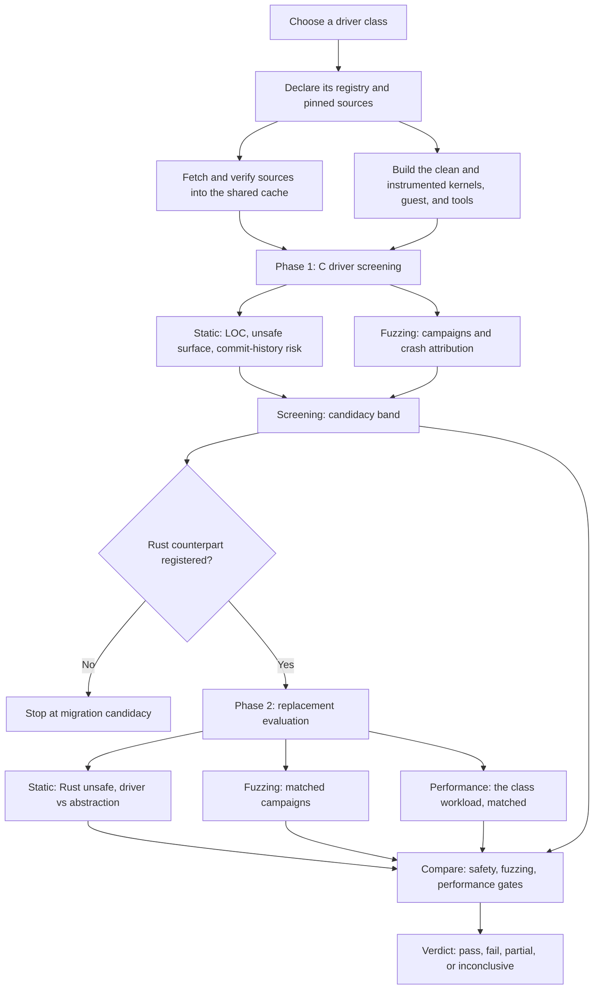

# KOxI v2

**KOxI** (Kernel Oxidation Instrument) is a methodology for deciding
whether migrating a Linux kernel driver from C to Rust is supported by
evidence, and a harness that carries it out.

KOxI is not a C-to-Rust translator and it is not an automatic
replacement decision. It is a diagnostic funnel: given a C driver, and
optionally a Rust counterpart, it collects comparable evidence and
emits a recommendation a maintainer can inspect and re-derive.

The methodology is not specific to any one kind of driver. The
evidence lenses, the two phases, the gate criteria and the verdict
semantics are the same whatever the driver does; what changes between
driver classes is the workload that exercises the driver, the registry
that describes how to load it, and the thresholds each gate is tested
at. A driver class is therefore an _instantiation_ of KOxI, and this
repository currently contains one: the block-device harness in
[`src/block/`](src/block/README.md), whose Phase-2 pair is `null_blk`
(C) versus `rnull` (Rust).

This README covers the methodology and what is shared across classes.
Everything needed to actually run the block harness is in
[`src/block/README.md`](src/block/README.md).

This repository is the Rust rewrite of the
[original shell/Python harness](https://github.com/guilherme-n-l/KOxI).
The methodology is the same; the instrument is not. `koxi` is a single
orchestrator binary that pins and builds its own subjects, drives qemu
guests, and computes its own statistics.

## Core idea

Rust migration is valuable only when the safety benefit is large
enough to justify rewrite cost, residual unsafe code, and possible
runtime overhead. KOxI makes that tradeoff explicit by measuring four
evidence lenses:

| Lens               | Question                                                            |
| ------------------ | ------------------------------------------------------------------- |
| Historical risk    | Has the C driver had safety-relevant fixes in its history?          |
| Residual unsafe    | How much unsafe Rust remains in the driver and its abstractions?    |
| Dynamic robustness | Does fuzzing show target-attributable crash regressions?            |
| Execution cost     | Does the Rust driver stay within the accepted performance envelope? |

Those lenses feed three verdict gates: **safety**, **fuzzing**, and
**performance**. The final verdict is deliberately conservative: a
clear failure in one measured gate is enough to argue against
replacing a mature C driver, and a gate with no usable evidence never
counts as a pass.

## What it measures

**Phase 1: migration candidacy.** Runs against C drivers only, and
answers whether a driver is worth considering for migration at all. It
collects static structure (LOC, functions, implicit unsafe
operations), commit-history risk (safety-related commits with CWE
classification), and dynamic robustness (syzkaller campaigns with
crash attribution). `koxi block screen` folds those into a band:
`strong_candidate`, `moderate`, `weak`, or `inconclusive`.

**Phase 2: replacement evaluation.** Runs when a Rust counterpart is
registered, and answers whether it is a defensible replacement. It
collects Rust unsafe-surface metrics split between driver code and the
shared `rust/kernel/` abstractions, syzkaller campaigns under the same
harness shape, and matched fio results for both drivers. `koxi block
compare` produces the three gates and an overall verdict: `pass`,
`fail`, `partial`, or `inconclusive`.



## Verdicts

| Verdict        | Meaning                                                                               |
| -------------- | ------------------------------------------------------------------------------------- |
| `pass`         | Evidence supports replacing the C driver with the Rust driver.                        |
| `fail`         | Evidence supports leaving the C driver in place or redirecting migration effort.      |
| `partial`      | Some evidence is useful, but missing or mixed dimensions require maintainer judgment. |
| `inconclusive` | The run did not produce enough decisive data for a recommendation.                    |

A gate that produced no usable evidence never counts as a pass. The
thresholds each gate is tested at are class-specific and live with the
instantiation.

## How the gates decide

Each gate states its criterion as a hypothesis test with an explicit
margin, so "we found no significant difference" can never be mistaken
for evidence of equivalence.

| Gate        | Gated quantity                                                                                                                   |
| ----------- | -------------------------------------------------------------------------------------------------------------------------------- |
| Safety      | The elimination rate: the fraction of CWE-classified fix commits whose class Rust removes at compile time.                       |
| Fuzzing     | Non-inferiority of the target-attributable crash rate ratio, rust over C, via the exact conditional binomial.                    |
| Performance | Per-workload TOST non-inferiority on the Hodges-Lehmann log-IOPS ratio, combined across workloads as an intersection-union test. |

The performance gate uses the (1 − 2α) order-statistic confidence
interval on the Hodges-Lehmann shift of log IOPS: every workload's
lower bound must clear the margin ratio. Combining cells as an
intersection-union test controls the family-wise error rate at α with
no multiplicity correction (Berger), and a cell that produced no
comparable evidence is an untested cell, so it fails rather than
passes silently. The fuzzing gate conditions on the total event count,
which makes the Rust share binomial with p fixed by the exposure
split; Clopper-Pearson bounds then transform into rate-ratio bounds.
With zero events on both sides the ratio is unbounded, so the verdict
falls back to the per-side exact Poisson rate bound and says so. Both
gates keep v1's rank statistics (Mann-Whitney U, Vargha-Delaney A12
with a DeLong interval, Holm-Bonferroni, the bootstrap median-delta
interval) as descriptive evidence.

## The model

- **`koxi.toml`** — per-project declaration, found by walking up from
  the working directory: pinned third-party sources, the `[build]`
  toolchain, asset overrides, and the instantiation's driver registry
  (`[block.drivers]` today).
- **`koxi.lock`** — machine-written resolved state: tarball sha256s,
  git commits, asset hashes, and build fingerprints. Committed like
  `Cargo.lock`; a build is skipped only on a fingerprint match.
- **`assets/`** — build inputs: the kernel configs, the fuzz kconfig
  fragment, the VM init script, and the commit classification rules.
  Defaults are embedded in the binary, a file under `assets/<name>`
  overrides them, and `koxi assets dump` materializes one for editing.
- **`artifacts/`** — build outputs: `bzImage`, the registered drivers'
  modules, and any `[build].extra-artifacts` such as the `vmlinux`
  syzkaller needs for symbolization, each sha256-locked. Two kernel
  flavors are built from one base config: the clean kernel for
  perf, `vm` and `metal`, and the fuzz kernel under `fuzz/` whose
  instrumentation set lives in a kconfig fragment merged with the
  kernel's own `merge_config.sh` and asserted against the final
  `.config`, so a dropped dependency fails the build instead of
  shipping an uninstrumented fuzz kernel.
- **`results/`** (the `--output` root) — measurement data, outside the
  lock and the home. `p1/<c>/<domain>/<hash>/` is a content-addressed
  baseline cache and `p2/<c>::<rs>/<campaign>/` holds named runs.
  Every result root carries a `manifest.toml` whose `[identity]` table
  is the hash input: the locked artifact shas, the host and
  acceleration tag, and the workload knobs. Directories are therefore
  self-describing, resumable, and safe to `rsync`, because a campaign
  records its baseline by hash rather than by symlink. The comparator
  refuses to pool results whose identities disagree on host or
  acceleration.
- **Guest runs** — the locked initramfs stays generic. Each run packs
  its driver module and setup spec into a small overlay cpio
  concatenated onto it, which works for qemu and kexec alike, boots,
  and talks to the guest over its baked-key dropbear.
- **`$KOXI_HOME`** (default `~/.koxi`) — shared across projects:
  `cache/` for sources, `tmp/` for build scratch, and
  `log/<project>/<run-id>/` for the run log and per-task subprocess
  logs.

## Commands

`koxi block …` is the block instantiation and has its own
[README](src/block/README.md). The rest of the tree is
class-independent:

| Command       | Purpose                                                                                          |
| ------------- | ------------------------------------------------------------------------------------------------ |
| `koxi vm`     | Boot the built kernel with a registered driver loaded and run a command or an interactive shell. |
| `koxi metal`  | Push artifacts to a bare-metal target, kexec into the test kernel, and reset it back.            |
| `koxi clean`  | Sweep dead build scratch; optionally collect the cache and remove the project's artifacts.       |
| `koxi assets` | List where each build input resolves from, and materialize defaults for editing.                 |
| `koxi nix`    | Write the runtime flake and a starter `koxi.toml` into the current directory.                    |

`--verbose`, `--debug`, `--logfile`, `--nologfile` and `--yes` are
global to every subcommand. Measurement knobs also read an environment
variable, with the command line winning over the environment and the
environment over the default.

## Bare metal (kexec)

The same two artifacts boot real hardware for perf runs. On a target
with Secure Boot off (`mokutil --sb-state`,
`cat /sys/kernel/security/lockdown`) and kexec-tools installed:

```sh
koxi metal boot    # push artifacts, kexec, wait for the guest dropbear
koxi metal reset   # reboot the target back into its resident OS
```

By hand, the equivalent is:

```sh
kexec -l bzImage --initrd=initramfs.cpio.gz \
      --append="console=tty0 koxi.net=dhcp"
kexec -e
```

`koxi.net=` selects guest networking: `dhcp`,
`<addr>/<prefix>,<gateway>`, or omit it for the qemu slirp defaults.
Wired Ethernet only, since the image carries no WiFi stack. Fuzzing
stays qemu-only by design.

## Housekeeping and concurrency

- **Concurrent runs** sharing `$KOXI_HOME` serialize on a cache lock:
  a run that fetches, extracts, or collects holds it for that work
  while the others wait with a note on the console. The lock is
  advisory and dies with the process, so a killed run never wedges
  the cache.
- **Build scratch** under `tmp/` carries a liveness lock for as long
  as its build runs. `koxi clean` sweeps only the dead ones, so it is
  safe to run beside a build; a scratch kept after a failed build is
  swept once that process exits.
- **`koxi clean --cache`** collects cache entries the project's
  `koxi.lock` does not reference, and `--artifacts` removes the
  build outputs. Results are never touched. `--nocache` clears the
  whole cache before a run.

## Instantiating a driver class

Most of the harness does not know what a block device is. Source
acquisition and pinning, the two kernel flavors, the guest userland
and its overlay transport, the syzkaller integration, the shared home
and its cache, the host fitness gate and the statistical core are all
class-independent, and live outside the instantiation:

| Shared                         | What it provides                                                  |
| ------------------------------ | ----------------------------------------------------------------- |
| `src/config.rs`, `src/lock.rs` | The project declaration and its resolved, pinned state.           |
| `src/fetch.rs`, `src/home.rs`  | Verified acquisition into a cache shared across projects.         |
| `src/kernel/`                  | The kernel tree and its clean and instrumented builds.            |
| `src/virt/`                    | Guest userland, the reproducible initramfs, and the qemu runner.  |
| `src/fuzz/`                    | Syzkaller acquisition and build.                                  |
| `src/host.rs`                  | Whether this machine can produce trustworthy campaign numbers.    |
| `src/stats.rs`                 | The tests the gates are stated in, validated against scipy and R. |

An instantiation supplies what is genuinely class-specific: the
registry entries that say how to load a driver and where its source
lives, a workload generator that exercises it (fio, for block
devices), the crash-attribution inputs for its fuzzing, and the
threshold each gate is calibrated at. `src/block/` is that, and its
README documents the shape.

One caveat about the current state: the phase orchestration and the
verdict aggregation live under `src/block/` rather than beside the
shared modules, because there has only ever been one instantiation to
generalize from. A second class would lift them out alongside
`src/stats.rs`, which is already class-independent.

## What changed from v1

The methodology is unchanged. The instrument was rebuilt because
several v1 results were not reproducible, and a few were not
measuring what they claimed.

**Measurement defects fixed.** These changed numbers, not just code:

| Defect in v1                                                                                                                          | v2                                                                                                                                               |
| ------------------------------------------------------------------------------------------------------------------------------------- | ------------------------------------------------------------------------------------------------------------------------------------------------ |
| fio ran with the implicit `psync` engine, which silently caps iodepth at 1, so the queue-depth axis of the matrix measured nothing.   | `--fio-engine` defaults to `io_uring` and is identity-bearing, so an engine change re-baselines rather than pools.                               |
| The safety-signal regex matched a bare `null` token, so every `null_blk:` commit subject counted as safety-related.                   | Classification rules live in the `static/classify.toml` asset, whose sha is part of the result identity; the driver's own name is not a signal.  |
| Commit mining paged the GitHub API against a moving `HEAD` with a floating "4 years ago" window.                                      | History comes from a locked, blobless `git-meta` mirror at a pinned rev with an absolute `[block.static].since` bound. Offline and reproducible. |
| The unsafe-surface scan globbed one directory level, silently skipping `rust/kernel/block/mq/*.rs` — where the unsafe actually lives. | The scan recurses, and counts `unsafe impl` alongside blocks and functions.                                                                      |
| The bootstrap confidence interval was unseeded, so the verdict was not reproducible.                                                  | Seeded from the campaign manifest; the same results directory re-derives the same verdict.                                                       |

**The statistics changed, and that is the substantive change.** v1
asked each gate whether it could detect a difference. A rank test
that fails to reject its null does not license the conclusion the
gate wanted to draw, which is that the Rust driver is _not worse_;
absence of a detected difference is not evidence of equivalence,
especially at the sample sizes a fuzzing campaign affords. Both
Phase-2 gates were rewritten around that distinction, and their v1
statistics were kept as descriptive evidence rather than deleted.

Removed as gate criteria:

- **Performance.** A Mann-Whitney U per fio workload with
  Holm-Bonferroni correction, gated on "no workload is significantly
  slower". A workload with few reps or high variance passes this by
  failing to reach significance, so the gate rewarded noisy data.
- **Fuzzing.** Mann-Whitney U plus Vargha-Delaney A12 over
  per-campaign crash counts, gated on "no significant large-effect
  increase". Rank tests on sparse counts have almost no power, so
  this passed essentially by default, and nothing reported how much
  evidence the campaigns had actually bought.

Added as gate criteria:

- **Performance** is now a TOST non-inferiority test per workload on
  the Hodges-Lehmann shift of log IOPS. The lower bound of the
  order-statistic confidence interval must clear the margin ratio, so
  the gate passes only on evidence of equivalence, not on absence of
  evidence. Workloads combine as an intersection-union test, which
  controls the family-wise error rate at alpha with no multiplicity
  correction (Berger), and a cell with too little data to bound its
  interval fails rather than passing quietly.
- **Fuzzing** is now a non-inferiority bound on the
  target-attributable crash _rate ratio_. Conditioning on the total
  event count makes the Rust share binomial with a proportion fixed
  by the exposure split, so Clopper-Pearson bounds transform directly
  into rate-ratio bounds. Rates, not counts, is what lets campaigns
  of unequal length be compared at all. With zero events on both
  sides the ratio is unbounded, so the verdict falls back to the
  per-side exact Poisson rate bound and labels itself as such, and
  every run reports the minimum detectable ratio at 80% power, so a
  pass on thin evidence is legible as one.

Retained, as descriptive evidence only: Mann-Whitney U,
Holm-Bonferroni, the percentile bootstrap interval on the median
IOPS delta, and A12, which now carries a DeLong confidence interval.
A global Wilcoxon signed-rank over per-workload log-median IOPS was
added alongside them to summarize whether the grid shifts as a whole.

The safety gate is unchanged: the elimination rate over CWE-classified
fix commits against its threshold.

**Reproducibility.** v1 fetched unpinned sources and rebuilt
everything every run. v2 keeps a `koxi.lock` of tarball sha256s and
resolved git commits, fingerprints every build (recipe version, source
sha, config sha, toolchain identity), and re-extracts a pristine tree
into scratch for each build. The initramfs is byte-reproducible
(sorted entries, epoch mtimes, `gzip -n`).

**Provenance.** v1 encoded a run's context in a directory-name hash
and linked baselines with symlinks. v2 writes a `manifest.toml` in
every result root whose `[identity]` table _is_ the hash input, so
directories are self-describing, resumable at rep granularity, and
survive `rsync` between machines. The comparator refuses to pool
results whose identities disagree on host or acceleration, which is
what kept KVM and TCG numbers apart.

**Dependencies.** v1 needed scipy, numpy, and R at analysis time. v2
implements the statistics in-tree and validates them against golden
fixtures generated from scipy/numpy and R (`wilcox.test`, pROC) under
pinned interpreters, so `cargo test` re-checks parity on every run.
v1's dropbear and syzkaller patches are gone: musl supplies `crypt()`
and `openpty()`, and the `scp -O` fix landed upstream.

**Guest transport.** v1 shipped a password hash in the image and
rebuilt it per driver. v2 bakes a public key at build time (no
`/etc/shadow` at all), keeps one generic image, and gives each run its
own `/koxi` tree as a small overlay cpio concatenated onto the base
initramfs. The same transport works for kexec on bare metal, where
there is no 9p.

**Interface.** v1's broker accepted every flag on every verb. In v2
each subcommand declares exactly the option groups it reads, so a
branch's `--help` is the truth about what that branch consumes. Env
var names are unchanged from v1 `block/scripts/flags`, and precedence
is CLI over environment over default.

## Known limitations

- The cache lock is one lock for the whole cache, not per source, and
  `koxi block setup` holds it for the whole run rather than only its
  fetches. Two setups sharing a `$KOXI_HOME` therefore serialize
  completely, even when they need different sources.
- `koxi clean --cache` collects against one project's lock. Other
  projects sharing `$KOXI_HOME` keep working but re-fetch what they
  lose, which is the trade a shared cache always makes.
- Older binaries still refuse a lock whose `version` is newer than
  they understand. That is the designed outcome rather than a parse
  error: unknown tables are preserved through load and save, so the
  version only rises when an existing table changes shape, and
  `tests/fixtures/lock_shape.toml` fails the build if one does
  without a decision.
- Real fuzz and perf campaigns need `/dev/kvm` and enough RAM for the
  guests. Both phases refuse a host that has neither; `--quick` and
  `--allow-unfit-host` proceed anyway, and the resulting numbers are
  not data.

## Repository layout

```text
.
|-- README.md              General KOxI methodology overview
|-- koxi.toml              Driver registry, pinned sources, toolchain
|-- koxi.lock              Machine-written resolved state
|-- flake.nix              Dev shell, runtime shell, package, git hooks
|-- assets/                Embedded build inputs (kconfigs, init, rules)
|-- templates/             `koxi nix init` output
|-- tests/fixtures/        Golden statistics fixtures and the lock shape
`-- src/
    |-- main.rs            Subcommand tree and one error path
    |-- cli.rs             Option groups, env layer, the `knobs!` macro
    |-- config.rs          koxi.toml
    |-- lock.rs            koxi.lock
    |-- assets.rs          Build-input resolution
    |-- fetch.rs           Pinned acquisition into the shared cache
    |-- home.rs            $KOXI_HOME layout, cache lock, cache GC
    |-- scratch.rs         Build scratch with liveness marking
    |-- host.rs            Host fitness gate (KVM, memory)
    |-- cmd.rs             Subprocess execution with teed task logs
    |-- stats.rs           The statistical core (scipy/R parity)
    |-- kernel/            Kernel source and build, per flavor
    |-- virt/              Guest userland, initramfs, qemu runner
    |-- fuzz/              Syzkaller acquisition and build
    |
    `-- block/             Block-device-driver KOxI instantiation
        |-- README.md      Block harness usage and implementation notes
        |-- cli.rs         Its option groups
        |-- perf.rs        fio matrix
        |-- fuzz.rs        Syzkaller campaigns
        |-- results.rs     Manifest-first results tree
        |-- static_analysis/  tree-sitter metrics, commit mining
        `-- compare/       The gates and the verdict
```

## Current instantiation

The active instantiation is the block-device harness, `koxi block …`.
Its main Phase-2 pair is `null_blk` (C) versus `rnull` (Rust);
additional C block drivers are registered.

See [`src/block/README.md`](src/block/README.md) for setup, commands,
the driver registry, the results layout, gate thresholds, bare-metal
runs, and the harness's own limitations.
