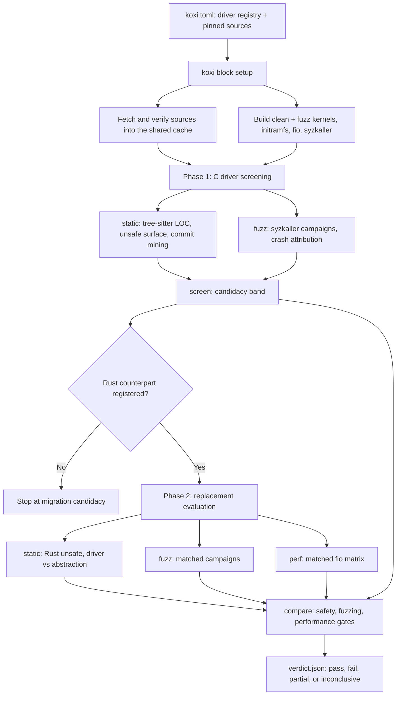

# KOxI v2

**KOxI** (Kernel Oxidation Instrument) is a methodology and harness for
deciding whether migrating a Linux kernel driver from C to Rust is
supported by evidence.

KOxI is not a C-to-Rust translator and it is not an automatic
replacement decision. It is a diagnostic funnel: given a C driver, and
optionally a Rust counterpart, it collects comparable evidence and
emits a recommendation a maintainer can inspect and re-derive.

This repository is the Rust rewrite of the
[original shell/Python harness](https://github.com/guilherme-n-l/KOxI).
The methodology is the same; the instrument is not. `koxi` is a single
orchestrator binary that pins and builds its own subjects, drives qemu
guests, and computes its own statistics. The current instantiation is
the block-device harness (`koxi block …`), with `null_blk` (C) versus
`rnull` (Rust) as the Phase-2 pair.

## Core idea

Rust migration is valuable only when the safety benefit is large
enough to justify rewrite cost, residual unsafe code, and possible
runtime overhead. KOxI makes that tradeoff explicit by measuring four
evidence lenses:

| Lens               | Question                                                            |
| ------------------ | ------------------------------------------------------------------- |
| Historical risk    | Has the C driver had safety-relevant fixes in its history?          |
| Residual unsafe    | How much unsafe Rust remains in the driver and its abstractions?    |
| Dynamic robustness | Does fuzzing show target-attributable crash regressions?            |
| Execution cost     | Does the Rust driver stay within the accepted performance envelope? |

Those lenses feed three verdict gates: **safety**, **fuzzing**, and
**performance**. The final verdict is deliberately conservative: a
clear failure in one measured gate is enough to argue against
replacing a mature C driver, and a gate with no usable evidence never
counts as a pass.

## What it measures

**Phase 1: migration candidacy.** Runs against C drivers only, and
answers whether a driver is worth considering for migration at all. It
collects static structure (LOC, functions, implicit unsafe
operations), commit-history risk (safety-related commits with CWE
classification), and dynamic robustness (syzkaller campaigns with
crash attribution). `koxi block screen` folds those into a band:
`strong_candidate`, `moderate`, `weak`, or `inconclusive`.

**Phase 2: replacement evaluation.** Runs when a Rust counterpart is
registered, and answers whether it is a defensible replacement. It
collects Rust unsafe-surface metrics split between driver code and the
shared `rust/kernel/` abstractions, syzkaller campaigns under the same
harness shape, and matched fio results for both drivers. `koxi block
compare` produces the three gates and an overall verdict: `pass`,
`fail`, `partial`, or `inconclusive`.



## Verdict gates

Each gate writes one JSON artifact under the campaign's `compare/`
directory. The gated quantity is stated as a hypothesis test with an
explicit margin, so "we found no significant difference" can never be
mistaken for evidence of equivalence.

| Gate        | Artifact          | Gated quantity                                                                                                                                               |
| ----------- | ----------------- | ------------------------------------------------------------------------------------------------------------------------------------------------------------ |
| Safety      | `safety.json`     | Elimination rate: the fraction of CWE-classified fix commits whose class Rust removes at compile time, against `--safety-threshold`.                         |
| Fuzzing     | `fuzz_stats.json` | Non-inferiority of the target-attributable crash **rate ratio** (rs/c) via the exact conditional binomial, against `--fuzz-rate-margin`.                     |
| Performance | `perf_stats.json` | Per-workload TOST non-inferiority on the Hodges-Lehmann log-IOPS ratio, combined across workloads as an intersection-union test, against `--perf-threshold`. |
| Overall     | `verdict.json`    | Conservative aggregation over the three, with the Phase-1 screening folded in.                                                                               |

Defaults:

| Knob                           | Default |
| ------------------------------ | ------- |
| Safety elimination threshold   | `34.2%` |
| Performance overhead threshold | `5%`    |
| Fuzz rate-ratio margin         | `2`     |
| Significance alpha             | `0.05`  |
| Bootstrap resamples            | `10000` |

The performance gate uses the (1 − 2α) order-statistic confidence
interval on the Hodges-Lehmann shift of log IOPS: every workload's
lower bound must clear the margin ratio. Combining cells as an
intersection-union test controls the family-wise error rate at α with
no multiplicity correction (Berger), and a cell that produced no
comparable evidence is an untested cell, so it fails rather than
passes silently. The fuzzing gate conditions on the total event count,
which makes the Rust share binomial with p fixed by the exposure
split; Clopper-Pearson bounds then transform into rate-ratio bounds.
With zero events on both sides the ratio is unbounded, so the verdict
falls back to the per-side exact Poisson rate bound and says so. Both
gates keep v1's rank statistics (Mann-Whitney U, Vargha-Delaney A12
with a DeLong interval, Holm-Bonferroni, the bootstrap median-delta
interval) as descriptive evidence.

## What changed from v1

The methodology is unchanged. The instrument was rebuilt because
several v1 results were not reproducible, and a few were not
measuring what they claimed.

**Measurement defects fixed.** These changed numbers, not just code:

| Defect in v1                                                                                                                          | v2                                                                                                                                               |
| ------------------------------------------------------------------------------------------------------------------------------------- | ------------------------------------------------------------------------------------------------------------------------------------------------ |
| fio ran with the implicit `psync` engine, which silently caps iodepth at 1, so the queue-depth axis of the matrix measured nothing.   | `--fio-engine` defaults to `io_uring` and is identity-bearing, so an engine change re-baselines rather than pools.                               |
| The safety-signal regex matched a bare `null` token, so every `null_blk:` commit subject counted as safety-related.                   | Classification rules live in the `static/classify.toml` asset, whose sha is part of the result identity; the driver's own name is not a signal.  |
| Commit mining paged the GitHub API against a moving `HEAD` with a floating "4 years ago" window.                                      | History comes from a locked, blobless `git-meta` mirror at a pinned rev with an absolute `[block.static].since` bound. Offline and reproducible. |
| The unsafe-surface scan globbed one directory level, silently skipping `rust/kernel/block/mq/*.rs` — where the unsafe actually lives. | The scan recurses, and counts `unsafe impl` alongside blocks and functions.                                                                      |
| The bootstrap confidence interval was unseeded, so the verdict was not reproducible.                                                  | Seeded from the campaign manifest; the same results directory re-derives the same verdict.                                                       |

**Reproducibility.** v1 fetched unpinned sources and rebuilt
everything every run. v2 keeps a `koxi.lock` of tarball sha256s and
resolved git commits, fingerprints every build (recipe version, source
sha, config sha, toolchain identity), and re-extracts a pristine tree
into scratch for each build. The initramfs is byte-reproducible
(sorted entries, epoch mtimes, `gzip -n`).

**Provenance.** v1 encoded a run's context in a directory-name hash
and linked baselines with symlinks. v2 writes a `manifest.toml` in
every result root whose `[identity]` table _is_ the hash input, so
directories are self-describing, resumable at rep granularity, and
survive `rsync` between machines. The comparator refuses to pool
results whose identities disagree on host or acceleration, which is
what kept KVM and TCG numbers apart.

**Dependencies.** v1 needed scipy, numpy, and R at analysis time. v2
implements the statistics in-tree and validates them against golden
fixtures generated from scipy/numpy and R (`wilcox.test`, pROC) under
pinned interpreters, so `cargo test` re-checks parity on every run.
v1's dropbear and syzkaller patches are gone: musl supplies `crypt()`
and `openpty()`, and the `scp -O` fix landed upstream.

**Guest transport.** v1 shipped a password hash in the image and
rebuilt it per driver. v2 bakes a public key at build time (no
`/etc/shadow` at all), keeps one generic image, and gives each run its
own `/koxi` tree as a small overlay cpio concatenated onto the base
initramfs. The same transport works for kexec on bare metal, where
there is no 9p.

**Interface.** v1's broker accepted every flag on every verb. In v2
each subcommand declares exactly the option groups it reads, so a
branch's `--help` is the truth about what that branch consumes. Env
var names are unchanged from v1 `block/scripts/flags`, and precedence
is CLI over environment over default.

## Quick start

```sh
# runtime shell: koxi + every tool the pipeline shells out to, pinned
nix develop .#koxi

koxi block test    # preflight: tools, toolchain sanity, headers
koxi block setup   # fetch + verify all sources, build everything

# boot the built kernel in qemu with a registry driver loaded and
# run a command (or omit it for an interactive shell)
koxi vm --driver rnull ls -l /dev/rnullb0

# the fio benchmark matrix: C baseline (cached by content hash) then
# the Rust pair under a named campaign; see results/*/manifest.toml
koxi block perf --quick --campaign trial

# host-side static analysis: tree-sitter LOC/unsafe metrics over the
# pinned tree, commit mining over the locked linux-meta mirror
koxi block static --campaign trial

# gate the campaign against its recorded baselines (results are
# rsync-safe: compare runs anywhere the results/ tree lives)
koxi block compare --campaign trial
```

Real campaigns need an x86_64 Linux host with `/dev/kvm` and enough
RAM for the guests; `koxi block perf` and `koxi block fuzz` refuse a
host that has neither. Development works anywhere nix does;
`nix develop` (the default shell) adds the rust toolchain, LSPs, and
git hooks.

## Commands

| Command              | Purpose                                                                                             |
| -------------------- | --------------------------------------------------------------------------------------------------- |
| `koxi block setup`   | Fetch and verify every source, build both kernel flavors and the guest userland.                    |
| `koxi block test`    | Preflight the host: tools on PATH, a compiler that produces running binaries, kernel build headers. |
| `koxi block static`  | Phase-1 and Phase-2 static analysis: AST metrics and commit mining.                                 |
| `koxi block fuzz`    | Syzkaller campaigns for the C baseline and the Rust driver.                                         |
| `koxi block perf`    | The fio benchmark matrix, one boot per driver.                                                      |
| `koxi block screen`  | Synthesize the Phase-1 candidacy band from cached baselines.                                        |
| `koxi block compare` | The three gates plus the overall verdict for a named campaign.                                      |
| `koxi block all`     | Every phase in order, phase-aware, under one campaign name.                                         |
| `koxi vm`            | Boot the built kernel with a registry driver and run a command or a shell.                          |
| `koxi metal`         | Push artifacts to a bare-metal target and kexec into the test kernel.                               |
| `koxi assets`        | List where each build input resolves from; materialize defaults for editing.                        |
| `koxi clean`         | Sweep dead build scratch; optionally the cache and the project's artifacts.                         |
| `koxi nix`           | Write the runtime flake and a starter `koxi.toml`.                                                  |

`--verbose`, `--debug`, `--logfile`, `--nologfile`, and `--yes` are
global. Every measurement knob also reads an environment variable,
keeping the names v1 used, with the command line winning over the
environment and the environment over the default.

## The model

- **`koxi.toml`** — per-project declaration (found by walking up from
  the cwd, cargo-style): third-party sources (tarball / `git` /
  `git-meta` history mirrors, all pinned), the `[build]` toolchain
  (`cc`, `target`), asset overrides, and the block driver registry.
- **`koxi.lock`** — machine-written resolved state: tarball sha256s,
  git commits, asset hashes, and build fingerprints (recipe + source
  sha + config sha + toolchain identity). Committed like `Cargo.lock`;
  builds are skipped only on a fingerprint match.
- **`assets/`** — build inputs (kconfigs, the VM init script, the
  commit classification rules). Defaults are embedded in the binary; a
  file under `assets/<name>` overrides them, and `[assets]` in
  `koxi.toml` can point elsewhere. `koxi assets dump` materializes
  defaults for editing.
- **`artifacts/`** — per-project build outputs: `bzImage` plus the
  registry drivers' kernel modules and any `[build].extra-artifacts`
  (e.g. `vmlinux` for syzkaller symbolization), each sha256-locked
  under the lock's `[artifacts]` table. The kernel is built in two
  flavors: the clean kernel (`bzImage`, modules alongside) for
  perf/vm/metal, and the fuzz kernel under `fuzz/` (`koxi vm --fuzz`
  boots it) whose instrumentation set — KASAN, KCOV, DWARF5, fault
  injection — lives in the `linux/fuzz.config` fragment asset, merged
  with the kernel's own `merge_config.sh` and asserted against the
  final `.config` so a dropped dependency fails the build instead of
  shipping an uninstrumented fuzz kernel. `koxi clean --artifacts`
  removes everything here.
- **Guest runs** — the locked initramfs stays generic; each run packs
  its driver module and setup spec into a small overlay cpio
  concatenated onto it (works for qemu and kexec alike), boots, and
  talks to the guest over its baked-key dropbear.
- **`results/`** (the `--output` root) — measurement data, outside the
  lock and the home. v1's p1/p2 skeleton:
  `p1/<c>/<domain>/<hash>/` is a content-addressed baseline cache and
  `p2/<c>::<rs>/<campaign>/` holds named runs. Every result root
  carries a `manifest.toml` whose `[identity]` table is the hash input
  — locked artifact shas, the host and acceleration tag, and the
  workload knobs.
- **`$KOXI_HOME`** (default `~/.koxi`) — shared across projects:
  `cache/` (tarballs, source trees, git mirrors), `tmp/` (build
  scratch, kept on failure for debugging), and
  `log/<project>/<run-id>/` (run log plus per-task subprocess logs).

Builds are deterministic by construction: every build re-extracts a
pristine tree into scratch, applies the config asset, and records its
input fingerprint in the lock.

## Bare metal (kexec)

The same two artifacts boot real hardware for perf runs. On a target
with Secure Boot off (`mokutil --sb-state`,
`cat /sys/kernel/security/lockdown`) and kexec-tools installed:

```sh
kexec -l bzImage --initrd=initramfs.cpio.gz \
      --append="console=tty0 koxi.net=dhcp"
kexec -e   # warm-boots into the test kernel immediately
```

`koxi metal boot` does this over ssh and waits for the test kernel's
dropbear; `koxi metal reset` returns the target to its resident OS.
`koxi.net=` selects guest networking: `dhcp`,
`<addr>/<prefix>,<gateway>`, or omit it for the qemu slirp defaults.
Wired Ethernet only (the image carries no WiFi stack); `reboot -f` in
the guest falls back to the resident OS via the normal bootloader.
Fuzzing stays qemu-only by design.

## Housekeeping and concurrency

- **Concurrent runs** sharing `$KOXI_HOME` serialize on a cache lock:
  a run that fetches, extracts, or collects holds it for that work
  while the others wait with a note on the console. The lock is
  advisory and dies with the process, so a killed run never wedges the
  cache.
- **Build scratch** under `tmp/` carries a liveness lock for as long
  as its build runs. `koxi clean` sweeps only the dead ones, so it is
  safe to run beside a build; a scratch kept after a failed build is
  swept once that process exits.
- **`koxi clean --cache`** collects cache entries the current
  project's `koxi.lock` does not reference, and `--artifacts` removes
  the project's build outputs. Results are never touched.
  `--nocache` still clears the whole cache before a run.

## Known limitations

- The cache lock is one lock for the whole cache, not per source, and
  `koxi block setup` holds it for the whole run rather than only its
  fetches. Two setups sharing a `$KOXI_HOME` therefore serialize
  completely, even when they need different sources.
- `koxi clean --cache` collects against one project's lock. Other
  projects sharing `$KOXI_HOME` keep working but re-fetch what they
  lose, which is the trade a shared cache always makes.
- Older binaries still refuse a lock whose `version` is newer than
  they understand. That is now the designed outcome rather than a
  parse error: tables a binary does not know are preserved through
  load and save, so the version only rises when an existing table
  changes shape, and `tests/fixtures/lock_shape.toml` fails the build
  if one does without a decision.
- Real fuzz and perf campaigns need `/dev/kvm` and enough RAM for the
  guests. Both phases refuse a host that has neither, naming what is
  missing; `--quick` (a smoke run) and `--allow-unfit-host` proceed
  anyway, and the resulting numbers are not data. The nixbox used for
  pipeline validation is such a host: fine for builds and smoke tests.

## Repository layout

```text
.
|-- README.md          This file: methodology, model, and usage
|-- koxi.toml          Driver registry, pinned sources, toolchain
|-- koxi.lock          Machine-written resolved state
|-- flake.nix          Dev shell, runtime shell, package, git hooks
|-- assets/            Embedded build inputs (kconfigs, init, rules)
|-- templates/         `koxi nix init` output
|-- tests/fixtures/    Golden statistics fixtures and the lock shape
`-- src/
    |-- main.rs        Subcommand tree and one error path
    |-- cli.rs         Option groups, env layer, the `knobs!` macro
    |-- config.rs      koxi.toml
    |-- lock.rs        koxi.lock
    |-- assets.rs      Build-input resolution
    |-- fetch.rs       Pinned acquisition into the shared cache
    |-- home.rs        $KOXI_HOME layout, cache lock, cache GC
    |-- scratch.rs     Build scratch with liveness marking
    |-- host.rs        Host fitness gate (KVM, memory)
    |-- cmd.rs         Subprocess execution with teed task logs
    |-- stats.rs       The statistical core (scipy/R parity)
    |-- kernel/        Kernel source and build, per flavor
    |-- virt/          Guest userland, initramfs, qemu runner
    |-- fuzz/          Syzkaller acquisition and build
    `-- block/         The block-device instantiation
        |-- cli.rs     Its option groups
        |-- perf.rs    fio matrix
        |-- fuzz.rs    Syzkaller campaigns
        |-- results.rs Manifest-first results tree
        |-- static_analysis/  tree-sitter metrics, commit mining
        `-- compare/   The gates and the verdict
```
