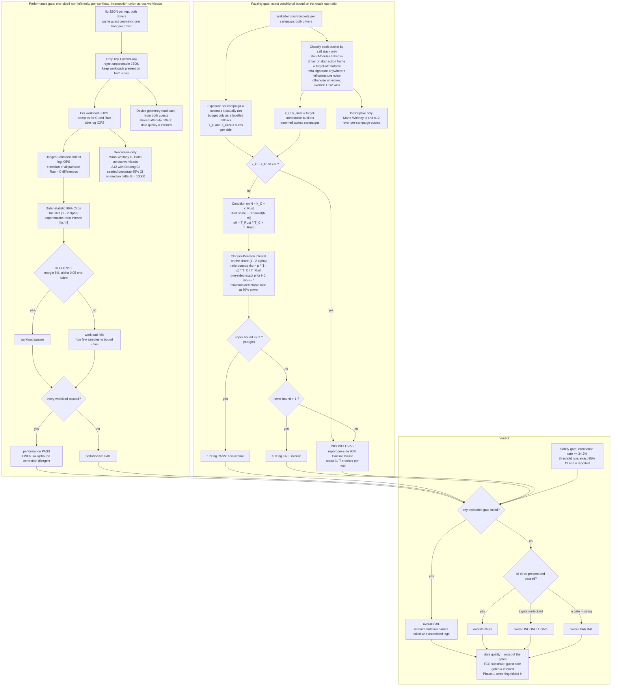

# How the gates test

The two measured gates share one shape: the null hypothesis is "the
Rust driver is worse by at least the margin", and only rejecting it
passes. Failing to reject never passes. Everything to the left of the
decision diamonds below is descriptive, kept for continuity with v1,
and gates nothing.

Two things the picture cannot show:

- **This is the left half of a TOST, not a TOST.** Equivalence testing
  runs two one-sided tests and needs both to reject. The performance
  gate runs one: it shows the Rust driver is not more than the margin
  slower, and never tests whether it is faster, because a faster Rust
  driver is not a problem for a migration decision. A pass means "not
  worse than 5%", never "the same". The artifact field names still say
  `tost`; the README and this page say non-inferiority.
- **v1 had the burden of proof backwards.** Its performance gate passed
  when a Mann-Whitney test failed to reach significance, and its
  fuzzing gate passed when sparse counts could not separate, which is
  "we know nothing" read as parity. v2 flips the null in both gates,
  and the fuzzing gate says inconclusive out loud when the data cannot
  bound the ratio either way.

The implementation is `src/block/compare/perf.rs` and
`src/block/compare/fuzz.rs` on top of `src/stats.rs`, whose functions
are checked against scipy, numpy and R fixtures on every `cargo test`.
